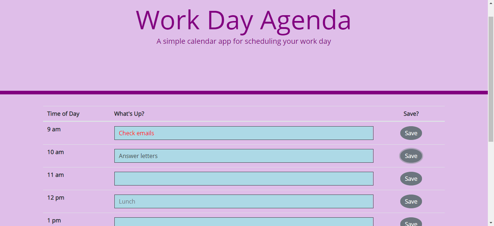
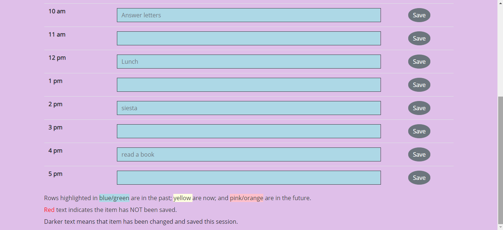

# Agenda - one business day calendar

Displays a page from your business calendar from 9am to 5pm.  Any items saved to localStorage in previous sessions will be automatically loaded.

There is one line for each hourly time slot.
Items in the past have a background color of light blue;
the current item is light yellow; and
items in the future are pink.

If no agenda has been saved in the past, Lunch at noon will be assumed; and nothing else is on the calendar.

The user may change the agenda items for each hour.  Any items the user changes this session is highlighted in red.

When a SAVE button is clicked, the corresponding item is saved in localStorage, and the text color becomes a bit darker than the original text, so the user can see what's been changed and saved this session.

Items that are still in red when the page is closed will not be saved.

This application is fully responsive on all screen sizes.

In this screen shot  of the top of the page:
- 9am: "Check emails" (in red) has been changed, but not saved.
- 10am: "Answer letters" (in dark text) has been changed and saved.  It will be displayed when the page is re-loaded.
- 12pm: "Lunch" (in lighter grey text) was already there.  
    Lunch is the default at noon, so it may have been loaded as the default; or the user may have saved it in an earlier session.

In the screen shot  of the bottom of the page, you can see notes to the user explaining the color scheme.